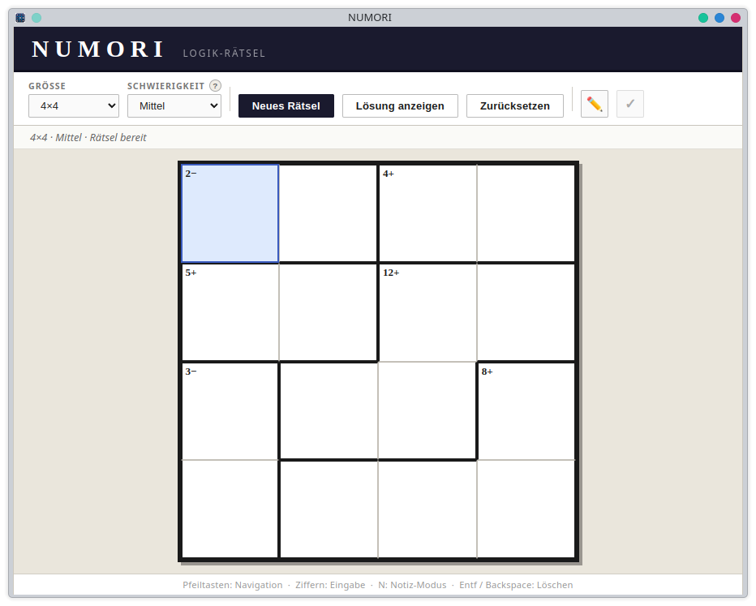

# Numori

Numori ist ein kostenloses, werbefreies Logik-Rätselspiel basierend auf dem Calcudoku-Prinzip.
Fülle das Gitter so aus, dass jede Zeile und Spalte jede Zahl genau einmal enthält – und die Käfig-Ziele erfüllt sind.

---

## Spielprinzip

- Jede Zeile und Spalte enthält jede Zahl von 1 bis N genau einmal
- Käfige geben eine Zielzahl und eine Rechenoperation vor (+, −, x, ÷)
- Die Zahlen im Käfig müssen mit der Operation das Ziel ergeben

---

## Features (v0.7.0)

- Prozedural generierte Rätsel – unbegrenzte einzigartige Puzzles
- Rastergrößen: 3x3 bis 7x7
- 3 Schwierigkeitsgrade (Leicht, Mittel, Schwer)
- Rätsel-IDs – Puzzles teilen und wiederholen
- PDF-Export – Rätsel als leeres A4-PDF speichern und ausdrucken
- Theme-System – Klassisch und Numori Dark
- Wettkampf-Modus mit Timer (nur aktivierbar auf leerem Rätsel)
- Gewinn-Banner mit Statistiken
- Sofort-Validierung (V-Taste)
- Notizen (N-Taste)
- Tipps
- Undo/Redo
- Vollständige Tastatursteuerung

---

## Themes

Numori bietet aktuell zwei Themes, wählbar über den Zahnrad-Button im Header. Die Auswahl wird gespeichert.

- **Klassisch** — warmes, helles Design mit Georgia-Schrift und beigem Hintergrund
- **Numori Dark** — dunkles Design im Stil des App-Icons, blaugraue Farbpalette, Poppins-Schrift und Goldakzente im Gewinnbanner

---

## Tastaturkürzel

| Taste | Aktion |
|-------|--------|
| Pfeiltasten | Zelle navigieren |
| 1–9 | Zahl eingeben |
| Entf / Backspace | Zelle leeren |
| N | Notizmodus umschalten |
| V | Validierung umschalten |
| Strg+Z | Undo |
| Strg+Y | Redo |

---

## Roadmap

### v0.8.0
- Konsolen-Theme (grün auf schwarz)
- Tägliches Rätsel
- Automatisches Speichern des Spielstands

### v1.0.0
- Android APK
- Statistiken und Bestzeiten
- Leaderboard

---

## Autor

Entwickelt von Lukas Schäfer — Feedback und Beiträge willkommen.

Lizenz: MIT
