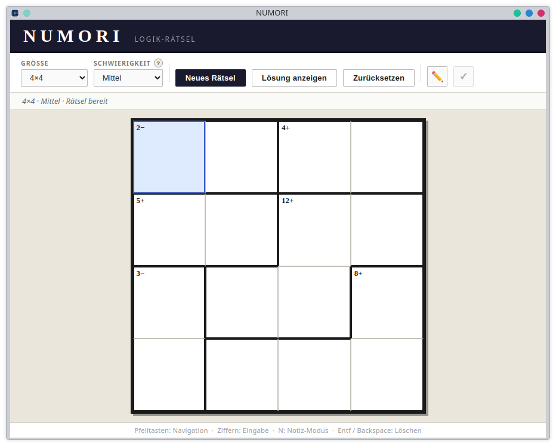

# Numori

Numori ist ein kostenloses, werbefreies Logik-Puzzle-Spiel — ähnlich wie Sudoku, aber mit Rechenoperationen.
Fülle das Gitter so, dass jede Zeile und Spalte jede Zahl genau einmal enthält, und jeder Käfig seinen Zielwert erreicht.



---

## Webversion

Numori ist auch als Web-App verfügbar:
[kaizo101.github.io/numori](https://kaizo101.github.io/numori)

Optimiert für Desktop und Mobile.

---

## Spielanleitung

- Jede Zeile und Spalte enthält jede Zahl von 1 bis N genau einmal
- Käfige definieren eine Zielzahl und eine Rechenoperation (+, −, ×, ÷)
- Die Zahlen in einem Käfig müssen mit der gegebenen Operation den Zielwert ergeben

---

## Features (v1.2.0)

- **Achievement-System** — über 25 Achievements in verschiedenen Kategorien (Core, Leaderboard, Console, Flipper); Toast-Benachrichtigung bei Freischaltung, Detail-Modal bei Klick, retroaktive Vergabe für Bestandsnutzer; Statistik-Tracking pro Größe, Schwierigkeit und Theme
- **PDF-Lösungsexport** — optionale zweite Seite im PDF-Export mit aufgedeckter Lösung
- **Tutorial als PDF** — interaktives Tutorial ist jetzt auch als druckbare HTML/PDF-Seite verfügbar
- Prozedural generierte Rätsel — unbegrenzt einzigartige Rätsel (AC-3 Constraint Propagation)
- Gittergrößen: 3×3 bis 9×9
- 4 Schwierigkeitsstufen (Leicht, Mittel, Schwer, Experte)
- Rätsel-IDs — teile und spiele spezifische Rätsel erneut
- **Android APK** — optimiertes Mobile-Layout mit Touch-Steuerung, Statusleiste mit Züge-Zähler und Kopier-Button
- **Globales Leaderboard** — Online-Ranking via Supabase; Top 10 pro Gittergröße und Schwierigkeit mit täglichen, wöchentlichen, monatlichen und Gesamtzeiträumen
- **Lokales Leaderboard** — Bestzeiten pro Gittergröße und Schwierigkeit mit Name, Zeit, Zügen und Datum; Gold/Silber/Bronze-Ranking
- **DE/EN Lokalisierung** — automatische Spracherkennung, manuell umschaltbar in den Einstellungen
- PDF-Export — speichere Rätsel als leeres A4-PDF zum Ausdrucken
- 4 Themes — Klassisch, Numori Dark, Console, Flipper
- Tagesrätsel mit Wochenplan und Bestzeit-Tracking
- Auto-Save und Wiederherstellung des Spielstands
- Gewinn-Banner mit Konfetti und Statistiken (Größe, Schwierigkeit, Zeit, Züge)
- Fehleranzeige wenn alle Zellen gefüllt sind aber die Lösung falsch ist
- Sofort-Validierung (V-Taste)
- Notiz-Modus (N-Taste)
- Hinweise
- Undo/Redo
- Vollständige Tastatur-Navigation
- Zahlenpad-Overlay — komplette Maus-Steuerung ohne Tastatur
- Musikplayer — Chiptune-Hintergrundmusik (Console-Theme)
- Statistiken — Bestzeiten, Durchschnittszeit, gelöste Rätsel pro Größe und Schwierigkeit
- Interaktives Tutorial — schrittweise Einführung in die Regeln
- Automatische Updates via Electron
- Einstellbare Schriftgröße (klein / mittel / groß)
- Impressum & Datenschutzhinweis in den Einstellungen
- Leaderboard-Consent mit Warnhinweis wenn deaktiviert
- Error Toast bei Supabase-Fehlern

---

## Themes

Numori bietet vier Themes, auswählbar über die Einstellungen. Deine Auswahl wird gespeichert.

- **Klassisch** — warmes, helles Design mit Georgia-Schrift und beigefarbenem Hintergrund
- **Numori Dark** — dunkles Design inspiriert vom App-Icon, Blau-Grau-Palette, Poppins-Schrift und Gold-Akzente im Gewinn-Banner
- **Console** — Retro-CRT-Ästhetik mit Phosphor-Grün-Text, Scanlines und Matrix-Animationen. ACCESS GRANTED / ACCESS DENIED als Gewinnbildschirm.
- **Flipper** — Pinball-Punktmatrix-Ästhetik mit Bernstein-Palette, Bitcount-Schrift und scrollendem Highscore-Ticker im Header.

---

## Tastaturkürzel

| Taste | Aktion |
|-------|--------|
| Pfeiltasten | Zellen navigieren |
| 1–9 | Zahl eingeben |
| Entf / Backspace | Zelle löschen |
| N | Notiz-Modus umschalten |
| V | Validierung umschalten |
| T | Timer ein/aus |
| Strg+Z | Undo |
| Strg+Y | Redo |
| Enter | Rätsel-ID laden |

---

## APK bauen

Der Android-Ordner ist nicht in diesem Repository enthalten, kann aber aus dem Quellcode reproduziert werden:

```bash
npm install
npx cap add android
npx cap sync android
# Dann in Android Studio öffnen oder:
cd android && ./gradlew assembleDebug
```

Voraussetzungen: Node.js, Android Studio mit SDK.

---

## Lizenz

Numori ist lizenziert unter der **GNU General Public License v3.0**.
Siehe [LICENSE](LICENSE) für den vollständigen Lizenztext.

---

## Autor

Entwickelt von Lukas Schäfer — Feedback und Beiträge willkommen.

---

## Drittanbieter-Lizenzen

### Poppins
Verwendet im Numori-Dark-Theme (`assets/fonts/Poppins-Medium.ttf`, `assets/fonts/Poppins-Italic.ttf`).

Lizenz: **SIL Open Font License 1.1**
Copyright: © 2014–2020 Indian Type Foundry

Die vollständige Lizenzdatei befindet sich unter `assets/fonts/OFL.txt`.

### VT323
Verwendet im Console-Theme.

Lizenz: **SIL Open Font License 1.1**
Copyright: © 2015 Peter Hull

### Share Tech Mono
Verwendet im Console-Theme.

Lizenz: **SIL Open Font License 1.1**
Copyright: © 2012 Carrois Type Design

### Bitcount Grid Single
Verwendet im Flipper-Theme (`assets/fonts/BitcountGridSingle-Regular.ttf`).

Lizenz: **SIL Open Font License 1.1**
Copyright: © 2024 Petr van Blokland

### Norse & Norse Bold
Verwendet im Space-Theme (`assets/fonts/Norse.otf`, `assets/fonts/Norsebold.otf`).

Lizenz: **Freeware** — © Joël Carrouché
Frei für persönliche und kommerzielle Nutzung einschließlich Einbettung in Anwendungen. Font-Dateien dürfen nicht modifiziert oder verkauft werden.
Vollständige Lizenz: `assets/fonts/freefont_license.txt`

### Lucide Icons
Verwendet in der Toolbar (Inline-SVG).

Lizenz: **ISC License**
Copyright: © 2022 Lucide Contributors
